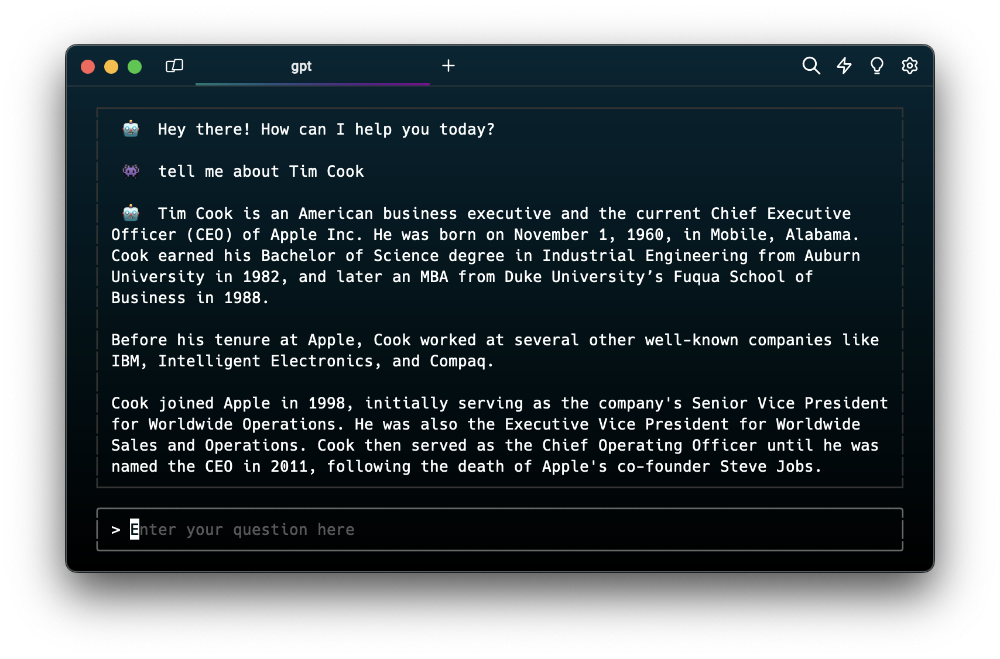

# `gpt` - ChatGPT 4 In Your Terminal

https://github.com/sharpvik/gpt/assets/23066595/8360b5c8-7e7d-4251-9cf2-9a770d807739

## Install

```bash
go install github.com/sharpvik/gpt
```

## Provide OpenAI API Key

```bash
gpt key <OPENAI_API_KEY>
```

## Boot Up the REPL

```bash
gpt repl
```



1. Press `I` and start typing.
2. Press `ENTER` to send the message.
3. `ESC`ape from the input and press `C` to copy the last GPT answer.
4. Use `CTRL+C` to leave the REPL environment.

## Ask a Quick Question

```bash
gpt 'Tell me about football'
```

## Copy Last Response

```bash
gpt copy
```
